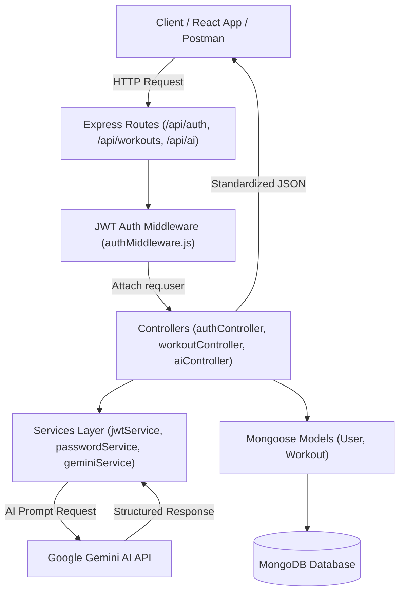

# 🏋️‍♂️ Ai FitTrack API — Fitness Tracking & Intelligent Workout Backend API

[](https://nodejs.org/)
[](https://expressjs.com/)
[](https://www.mongodb.com/)
[](https://jwt.io/)
[](https://aistudio.google.com/)
[](https://opensource.org/licenses/ISC)

> A production-grade, secure RESTful backend API built with **Node.js, Express.js, MongoDB (Mongoose), JWT authentication, bcrypt.js, and Google Gemini AI**. Ai FitTrack API empowers users to log workouts, track fitness history, perform multi-criteria searches, and generate personalized, AI-driven exercise routines and analytical insights.

---

## 📌 Table of Contents

- [Problem Statement](#-problem-statement)
- [✨ Key Features](#-key-features)
- [🛠️ Tech Stack](#️-tech-stack)
- [📐 Architecture & Design Pattern](#-architecture--design-pattern)
- [📂 Directory Structure](#-directory-structure)
- [⚡ Quick Start & Setup](#-quick-start--setup)
  - [Prerequisites](#prerequisites)
  - [Installation](#installation)
  - [Environment Variables](#environment-variables)
  - [Running the Database](#running-the-database)
  - [Starting the Application](#starting-the-application)
- [🚀 Live Demo Script](#-live-demo-script)
- [📖 API Reference Documentation](#-api-reference-documentation)
  - [Authentication Endpoints](#1-authentication-endpoints)
  - [Workout Management Endpoints](#2-workout-management-endpoints)
  - [Google Gemini AI Endpoints](#3-google-gemini-ai-endpoints)
- [🧪 Postman Testing Guide](#-postman-testing-guide)
- [🔒 Security & Best Practices](#-security--best-practices)
- [🔮 Future Roadmap](#-future-roadmap)

---

## 💡 Problem Statement

Traditional fitness apps often act as passive digital logbooks, storing static numbers without offering actionable, personalized advice. Modern users demand:
1. **Intelligent Guidance**: Tailored exercise routines accounting for age, experience level, and specific goals.
2. **Actionable Performance Analysis**: Analytical evaluation of duration, total volume, and calorie expenditure.
3. **Data Security & Isolation**: Strict user-level data segregation preventing unauthorized access across accounts.

**Ai FitTrack API** addresses these challenges by uniting robust JWT-authenticated workout management with real-time Google Gemini AI integration.

---

## ✨ Key Features

- 🔐 **Secure Authentication**: User registration and login using salted bcrypt password hashing (`10 rounds`) and JWT bearer authorization.
- 👤 **User Profiles**: Protected user profile retrieval with automatic sensitive field masking (`password` removed from responses).
- 🏋️ **Workout Management (CRUD)**: Create, read all, read by ID, update, and delete workout records.
- 🔍 **Multi-Criteria Search**: Dynamic regex and date-range searching by workout name, category, and specific date.
- 🛡️ **Strict User Isolation**: Authorization guards ensuring users can only view, modify, or delete their own workouts.
- 🤖 **AI Workout Recommendations**: Personalized workout routines, exercise breakdowns, safety tips, and motivational guidance generated dynamically via Google Gemini AI.
- 📊 **AI Fitness Insights**: Intelligent statistical analysis evaluating user effort, volume, calorie burn rates, and progression milestones.
- 🚨 **Centralized Error Handling**: Unified standard JSON error response handler covering validation failures, invalid ObjectIds (`CastError`), duplicate email keys (`11000`), JWT authentication errors, and API service timeouts.

---

## 🛠️ Tech Stack

- **Runtime Engine**: [Node.js](https://nodejs.org/) (v18+)
- **Web Framework**: [Express.js](https://expressjs.com/) (v4.21.2)
- **Database & ODM**: [MongoDB](https://www.mongodb.com/) & [Mongoose](https://mongoosejs.com/) (v8.12.0)
- **Authentication**: [JSON Web Token (JWT)](https://jwt.io/) & [bcryptjs](https://github.com/dcodeIO/bcrypt.js)
- **AI Model Engine**: [Google Generative AI SDK](https://www.npmjs.com/package/@google/generative-ai) (`@google/generative-ai` with `gemini-3.8-flash`)
- **Environment & Middleware**: `dotenv`, `cors`, `nodemon`

---

## 📐 Architecture & Design Pattern

The application strictly adheres to the **Model-View-Controller (MVC)** architectural pattern combined with a modular **Service Layer** to maintain clean separation of concerns.



---

## 📂 Directory Structure

```text
ai-fittrack-api/
├── config/
│   └── db.js                 # Database connection logic
├── controllers/
│   ├── aiController.js       # AI recommendation & insights handler
│   ├── authController.js     # User registration, login, profile logic
│   └── workoutController.js  # Workout CRUD & search handlers
├── middleware/
│   ├── authMiddleware.js     # Bearer JWT verification & user guard
│   └── errorMiddleware.js    # Global centralized error handler
├── models/
│   ├── User.js               # Mongoose User schema & output sanitization
│   └── Workout.js            # Mongoose Workout schema with User ref
├── routes/
│   ├── aiRoutes.js           # /api/ai endpoint definitions
│   ├── authRoutes.js         # /api/auth endpoint definitions
│   └── workoutRoutes.js      # /api/workouts endpoint definitions
├── services/
│   ├── geminiService.js      # Google Gemini API integration with model fallback
│   ├── jwtService.js         # JWT signing & verification service
│   └── passwordService.js    # bcrypt hashing & comparison service
├── utils/
│   └── response.js           # Standardized JSON response formatters
├── .env                      # Local environment secrets
├── .env.example              # Environment variables template
├── .gitignore                # Git ignore rules
├── demo.js                   # Automated end-to-end demo script
├── package.json              # Project dependencies & scripts
├── server.js                 # Express application entry point
└── README.md                 # Documentation & setup guide
```

---

## ⚡ Quick Start & Setup

### Prerequisites

- **Node.js**: v18.x or higher installed. Check version:
  ```bash
  node -v
  ```
- **MongoDB**: Installed locally or a valid [MongoDB Atlas](https://www.mongodb.com/cloud/atlas) connection URI.
- **Google Gemini API Key**: Free API key from [Google AI Studio](https://aistudio.google.com/).

### Installation

1. **Clone the repository**:
   ```bash
   git clone https://github.com/SSDP-codes/FitSenseAPI.git
   cd FitSenseAPI
   ```

2. **Install node dependencies**:
   ```bash
   npm install
   ```

### Environment Variables

Create a `.env` file in the project root:

```bash
cp .env.example .env
```

Configure your `.env` file with your credentials:

```env
PORT=5000
MONGO_URI=mongodb://localhost:27017/aifittrack
JWT_SECRET=your_super_secret_jwt_key_here
GEMINI_API_KEY=AIzaSy_your_google_gemini_api_key_here
GEMINI_MODEL=gemini-3.8-flash
```

> ⚠️ **Note**: Do not commit your `.env` file to source control. `.env` is listed in `.gitignore`.

### Running the Database

- **Windows**:
  ```powershell
  net start MongoDB
  ```
- **macOS / Linux**:
  ```bash
  sudo systemctl start mongod
  ```

### Starting the Application

- **Development Mode (with Nodemon auto-reload)**:
  ```bash
  npm run dev
  ```
- **Production Mode**:
  ```bash
  npm start
  ```

The server will start listening at `http://localhost:5000`.

---

## 🚀 Live Demo Script

The repository includes a ready-to-use automated testing script that executes a complete end-to-end demonstration in the terminal:

1. Keep your server running (`npm run dev`).
2. Open a second terminal window in the project root and run:
   ```bash
   npm run demo
   ```

It will automatically execute and format outputs for:
- Health check
- User registration & login
- Profile fetch
- Creating workouts
- Search workouts by category
- Updating workout records
- Generating live Google Gemini AI workout plans
- Generating live Google Gemini AI insights
- Verifying 401 Unauthorized access guard

---

## 📖 API Reference Documentation

### 1. Authentication Endpoints

#### Register User
`POST /api/auth/register` (Public)

- **Request Body**:
  ```json
  {
    "name": "John Doe",
    "email": "john@example.com",
    "password": "password123"
  }
  ```
- **Response** (`201 Created`):
  ```json
  {
    "success": true,
    "message": "User registered successfully",
    "user": {
      "id": "670c1a9f8b2d1c3a4e5f6a7b",
      "name": "John Doe",
      "email": "john@example.com",
      "createdAt": "2026-09-29T14:00:00.000Z"
    }
  }
  ```

#### Login User
`POST /api/auth/login` (Public)

- **Request Body**:
  ```json
  {
    "email": "john@example.com",
    "password": "password123"
  }
  ```
- **Response** (`200 OK`):
  ```json
  {
    "success": true,
    "message": "Login successful",
    "token": "eyJhbGciOiJIUzI1NiIsInR5cCI6IkpXVCJ9...",
    "user": {
      "id": "670c1a9f8b2d1c3a4e5f6a7b",
      "name": "John Doe",
      "email": "john@example.com"
    }
  }
  ```

#### Get Current Profile
`GET /api/auth/profile` (Protected — Requires `Authorization: Bearer <token>`)

- **Response** (`200 OK`):
  ```json
  {
    "success": true,
    "message": "User profile retrieved successfully",
    "user": {
      "id": "670c1a9f8b2d1c3a4e5f6a7b",
      "name": "John Doe",
      "email": "john@example.com",
      "createdAt": "2026-09-29T14:00:00.000Z"
    }
  }
  ```

---

### 2. Workout Management Endpoints

> All workout endpoints require header `Authorization: Bearer <token>`.

#### Create Workout
`POST /api/workouts`

- **Request Body**:
  ```json
  {
    "workoutName": "Morning Running",
    "category": "Cardio",
    "duration": 45,
    "caloriesBurned": 380,
    "workoutDate": "2026-09-29"
  }
  ```
- **Response** (`201 Created`):
  ```json
  {
    "success": true,
    "message": "Workout created successfully",
    "data": {
      "id": "670c2b1a9f8b2d1c3a4e5f6c",
      "user": "670c1a9f8b2d1c3a4e5f6a7b",
      "workoutName": "Morning Running",
      "category": "Cardio",
      "duration": 45,
      "caloriesBurned": 380,
      "workoutDate": "2026-09-29T00:00:00.000Z"
    }
  }
  ```

#### Get All Workouts
`GET /api/workouts`

- **Response** (`200 OK`):
  ```json
  {
    "success": true,
    "message": "Workouts retrieved successfully",
    "data": [...]
  }
  ```

#### Search Workouts
`GET /api/workouts/search?name=running&category=Cardio&date=2026-09-29`

- **Response** (`200 OK`):
  ```json
  {
    "success": true,
    "message": "Workouts search completed",
    "data": [...]
  }
  ```

#### Get Workout by ID
`GET /api/workouts/:id`

- **Response** (`200 OK`):
  ```json
  {
    "success": true,
    "message": "Workout retrieved successfully",
    "data": { ... }
  }
  ```

#### Update Workout
`PUT /api/workouts/:id`

- **Request Body**:
  ```json
  {
    "duration": 50,
    "caloriesBurned": 420
  }
  ```

#### Delete Workout
`DELETE /api/workouts/:id`

- **Response** (`200 OK`):
  ```json
  {
    "success": true,
    "message": "Workout deleted successfully",
    "data": { "id": "670c2b1a9f8b2d1c3a4e5f6c" }
  }
  ```

---

### 3. Google Gemini AI Endpoints

> All AI endpoints require header `Authorization: Bearer <token>`.

#### Generate AI Workout Recommendation
`POST /api/ai/recommendation`

- **Request Body**:
  ```json
  {
    "age": 25,
    "fitnessGoal": "Weight loss & muscle definition",
    "experienceLevel": "Beginner"
  }
  ```
- **Response** (`200 OK`):
  ```json
  {
    "success": true,
    "message": "AI workout recommendation generated successfully",
    "data": {
      "workoutPlan": "A balanced 4-day workout plan emphasizing high-volume cardio and progressive bodyweight resistance training...",
      "weeklySchedule": [
        "Day 1: Upper body resistance + light walk",
        "Day 2: Lower body & core routine"
      ],
      "suggestedExercises": [
        {
          "name": "Bodyweight Squats",
          "sets": "3",
          "repsOrDuration": "15 reps",
          "description": "Essential lower body movement targeting quadriceps and glutes."
        }
      ],
      "trainingTips": ["Maintain proper form", "Stay hydrated"],
      "safetyRecommendations": ["Warm up for 8-10 minutes before starting"],
      "motivationalGuidance": "Every single workout brings you closer to your personal best!",
      "disclaimer": "This recommendation is general fitness guidance and not a substitute for professional medical advice."
    }
  }
  ```

#### Generate AI Fitness Insights
`POST /api/ai/insights`

- **Request Body**:
  ```json
  {
    "totalWorkouts": 15,
    "averageWorkoutDuration": 45,
    "caloriesBurned": 5500
  }
  ```
- **Response** (`200 OK`):
  ```json
  {
    "success": true,
    "message": "AI fitness insights generated successfully",
    "data": {
      "performanceAnalysis": "Completing 15 sessions averaging 45 minutes demonstrates exceptional consistency...",
      "improvementSuggestions": ["Incorporate High-Intensity Interval Training (HIIT)"],
      "motivationalAdvice": "You have established strong training momentum!",
      "fitnessProgressSummary": "15 workouts completed with over 5,500 kcal burned."
    }
  }
  ```

---

## 🧪 Postman Testing Guide

To test using Postman or Thunder Client, follow this sequence:

1. **Register**: Send `POST /api/auth/register` with user credentials.
2. **Login**: Send `POST /api/auth/login`. Copy the returned `token`.
3. **Set Token**: In Postman, navigate to `Authorization` -> Select `Bearer Token` -> Paste the token.
4. **Test CRUD & Search**:
   - Create workouts via `POST /api/workouts`.
   - List history via `GET /api/workouts`.
   - Filter via `GET /api/workouts/search?category=Cardio`.
5. **Test AI Engine**:
   - Send prompt payload to `POST /api/ai/recommendation`.
   - Send statistical data to `POST /api/ai/insights`.
6. **Test Failure Scenarios**:
   - Omit token -> `401 Unauthorized`.
   - Query invalid ObjectId -> `400 Bad Request`.
   - Query another user's workout ID -> `403 Forbidden`.

---

## 🔒 Security & Best Practices

- **Salted Password Hashing**: Passwords are encrypted using `bcryptjs` with salt rounds = `10`.
- **JWT Authentication**: Stateless token verification attached to incoming requests via Bearer middleware.
- **Resource Ownership Verification**: Queries enforce `user: req.user._id` to prevent vertical and horizontal privilege escalation.
- **Data Protection**: Mongoose `toJSON` transforms automatically strip sensitive password hashes.
- **API Key Safeguards**: Gemini API keys are isolated within environment variables and excluded from source control.

---

## 📄 License

This project is licensed under the **ISC License**.
